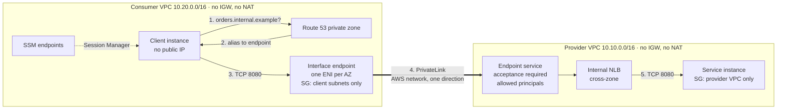

# Architecture

## The path

1. The client asks for `orders.internal.example`. Only the consumer VPC can see that private zone.
2. The record is an alias to the interface endpoint's regional DNS name, which resolves to the endpoint's network interfaces in each AZ.
3. The endpoint's security group admits the service port from the consumer's private subnets only.
4. PrivateLink carries the connection to the provider's endpoint service. Traffic can only start on the consumer side; the provider cannot open connections back into the consumer VPC.
5. The internal NLB forwards to healthy targets in any AZ.

There is no VPC peering, Transit Gateway or route between the two VPCs, which is why their CIDRs could even overlap.

## Modules

| Module | Creates | Guard-rails |
|---|---|---|
| `network` | VPC, private subnets in N AZs, one private route table, flow logs to CloudWatch | No internet or NAT gateway; default security group emptied; at least 2 AZs |
| `endpoint-service` | Internal NLB, target group, listener, VPC endpoint service | Internal only; `acceptance_required`; explicit `allowed_principals`, `"*"` rejected |
| `endpoint-consumer` | Interface endpoint and its security group | At least 2 subnets; client CIDRs required, `0.0.0.0/0` rejected; no egress rules |
| `private-dns` | Private hosted zone, alias records, Resolver query logging | Zone only associated with the listed VPCs |
| `service-endpoints` | SSM, SSM Messages, EC2 Messages interface endpoints; S3 gateway endpoint | 443 from the VPC CIDR only |

`envs/lab` wires them together and adds two optional test instances (IMDSv2 only, encrypted volumes, no public IP, no SSH key).

## Why PrivateLink here, and not peering or Transit Gateway

| | VPC peering / Transit Gateway | PrivateLink |
|---|---|---|
| What is exposed | Whole networks (routes) | One service (port) |
| Direction | Both ways, governed by routes and security groups | Consumer to provider only |
| Overlapping CIDRs | Not supported | Supported |
| Cross-account control | Route and SG changes on both sides | Provider lists allowed principals and accepts each connection |
| Cost model | TGW: per attachment-hour and per GB; peering: data transfer | Per endpoint ENI-hour and per GB processed, plus the NLB |

PrivateLink is the better fit when a team offers **one service** to other teams or accounts and should not see the rest of their network. Peering or a Transit Gateway fit when networks genuinely need to talk to each other in both directions.

## Observability

- **VPC Flow Logs** (both VPCs, 1-minute aggregation): accepted and rejected connections, the first evidence when a security group is wrong.
- **Route 53 Resolver query logs** (consumer VPC): every name lookup, the first evidence when "it doesn't resolve".
- **NLB target health**: in CloudWatch metrics (`HealthyHostCount`, `UnHealthyHostCount`).
- The DNS and TCP probes of [project 08](https://github.com/inigogonzalezgarcia/08-edge-health-slo-monitor) can run from the client instance against `orders.internal.example:8080` to turn this path into an SLO.
